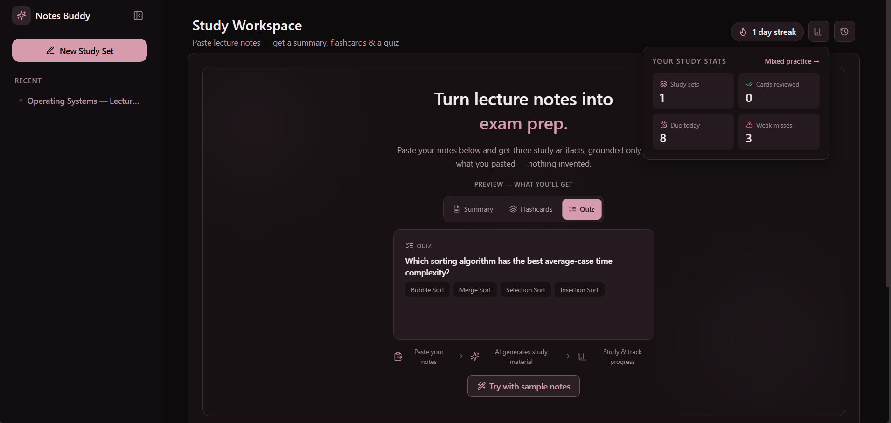
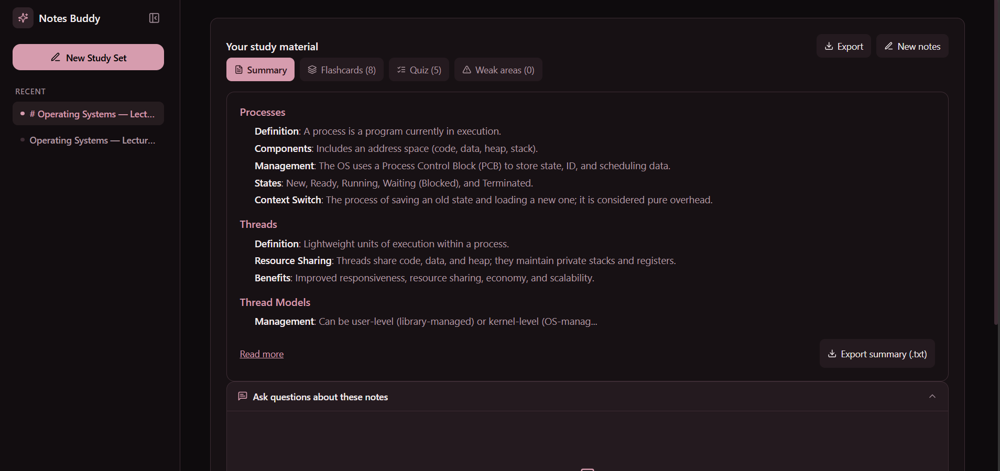
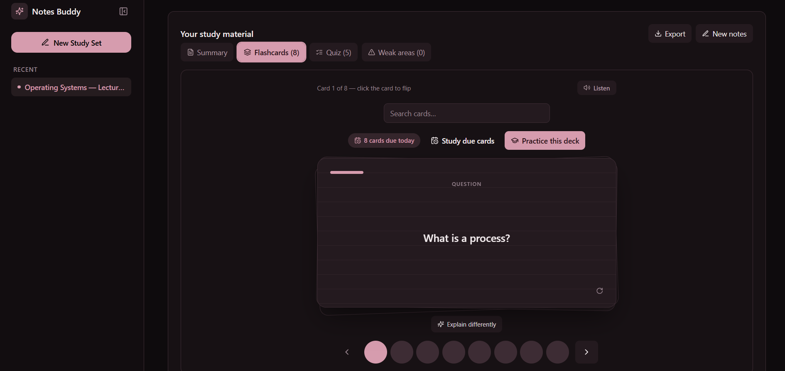
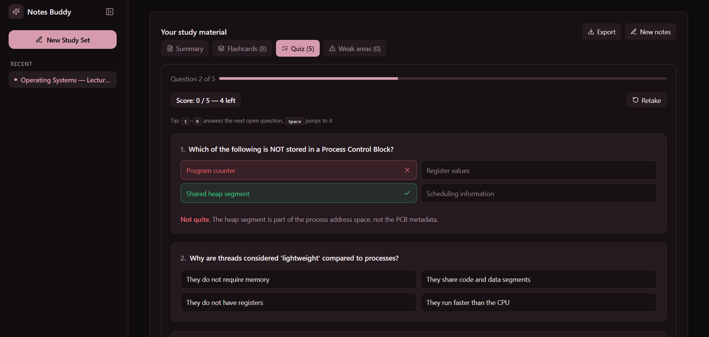
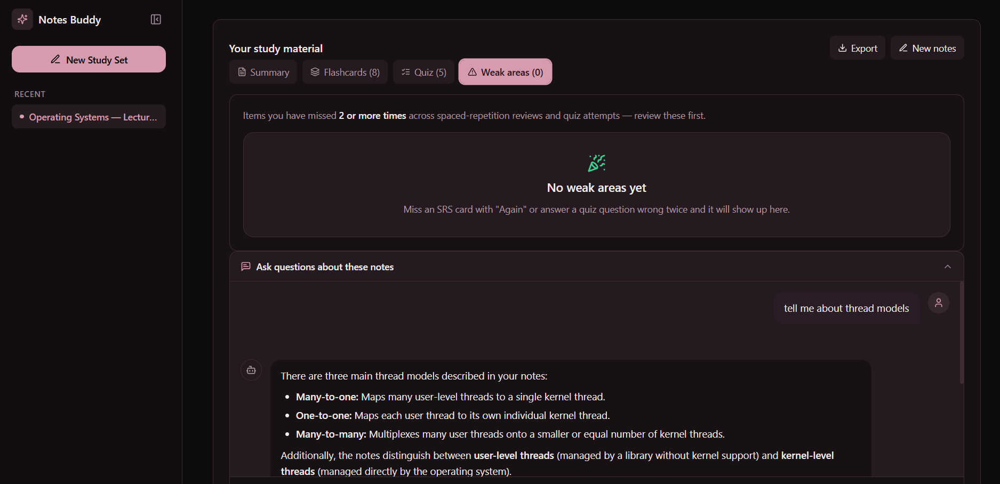

# AI Study Notes Buddy

> Paste your lecture notes — get a **summary**, **flashcards**, and a **quiz**, grounded only in what you pasted. Then study them with spaced repetition, track your weak areas, and ask follow-up questions answered strictly from your notes.

**Live app:** https://ai-study-notes-buddy.vercel.app
**Built with:** Next.js 15 · React 19 · TypeScript · Google Gemini (Vercel AI SDK) · Tailwind CSS v4 · Framer Motion



---

## Screenshots

| Generated summary | Flashcard deck |
| --- | --- |
|  |  |

| Interactive quiz | Follow-up chat grounded in notes |
| --- | --- |
|  |  |

---

## Features

- **Structured study material, not a chatbot** — one paste produces three artifacts (markdown summary, 3–12 flashcards, 2–8 MCQs) as schema-validated JSON via `generateObject` + zod
- **Generation options** — difficulty (easy/medium/hard), artifact counts, and output language (English / اردو with RTL + Nastaliq font)
- **Flashcards, three ways** — browse (flip, arrows, search), practice (know/don't-know with re-queue), and **SRS study mode** (simplified SM-2: Again/Good/Easy, ease factors, due-today queue). Text-to-speech listen button included
- **Interactive quiz** — lock-on-answer, instant right/wrong feedback with explanations, live score, retake, and an end-of-quiz "Review your mistakes" panel
- **Weak areas** — anything missed twice surfaces in one tab with jump-to-review links
- **Follow-up chat** — streaming Q&A grounded in the pasted notes; notes are embedded in the system prompt server-side so answers can't drift
- **File import** — paste text, or import `.txt` / `.md` / text-based PDF (parsed locally, nothing uploaded)
- **History & persistence** — every set saved to localStorage (cap 20), reopen with zero tokens, live search, delete with 8-second Undo toast
- **Mixed practice** — a combined shuffled quiz across all saved sets
- **Daily streak + study stats** — consecutive-day counter and per-set totals
- **Word export** — one click downloads a real `.doc` handout
- **Keyboard-first** — Space flips cards, `1/2/3` rate recall, `1–9` answer quiz questions
- **Installable PWA** — manifest + service worker (offline shell; API never cached)
- **Accessible** — WCAG 2.1 AA, axe-clean, full keyboard support, `prefers-reduced-motion` respected throughout

## Quick Start

```bash
npm install
cp .env.example .env.local   # add your Gemini API key (free: https://aistudio.google.com/apikey)
npm run dev                  # http://localhost:3000
```

| Variable | Required | Description |
| --- | --- | --- |
| `GOOGLE_GENERATIVE_AI_API_KEY` | Yes | Gemini API key — server-side only, never exposed to the client |
| `GOOGLE_MODEL` | No | Override the default model (`gemini-3.1-flash-lite`) |

## Architecture

```
app/
  page.tsx                  # SplashGate → OnboardingGate → NotesBuddy
  layout.tsx                # Fonts (Playfair + Noto Nastaliq), metadata, SW registration
  globals.css               # Tailwind v4 @theme tokens (dusty-rose-on-black), keyframes, print CSS
  manifest.ts               # PWA manifest
  study-set/[id]/page.tsx   # Deep link: open a saved set by id (404 state if missing)
  share/page.tsx            # Import a set shared via /share?s=<base64>
  mixed-practice/page.tsx   # Combined quiz pulled from all saved sets
  api/notes/route.ts        # POST notes → summary+flashcards+quiz (generateObject + zod)
  api/notes/chat/route.ts   # POST follow-up chat (streamText; notes injected server-side)
  api/notes/explain/route.ts# POST "explain differently" for one card
  api/chat/route.ts         # Legacy streaming chat route
components/
  notes-buddy.tsx           # Orchestrator: input/generating/result/error state machine + persistence
  notes-input.tsx           # Hero (tabbed auto-cycling preview) + compose view + Generate
  notes-result.tsx          # Tabs: Summary | Flashcards | Quiz | Weak areas
  flashcards-view.tsx       # Browse / practice / SRS study modes, deck-stack flip cards, TTS
  quiz-view.tsx             # MCQ quiz with live score, keyboard shortcuts, review panel
  weak-areas-view.tsx       # Most-missed items with jump-to-review
  notes-chat.tsx            # Grounded follow-up chat panel
  input-top-bar.tsx         # Streak chip + stats/recent popovers
  app-shell/app-shell.tsx   # Sidebar (collapsible, persisted), mobile drawer, skip link
  splash-screen.tsx         # Splash on every page load (tri-state, no home flash)
  onboarding-welcome.tsx    # 3-step welcome per page load
  notes-history.tsx         # Saved sets: search, reopen, delete
lib/
  config.ts                 # SINGLE SOURCE OF TRUTH: prompts, model, generation config, error copy
  srs.ts                    # Simplified SM-2 scheduler (pure functions)
  weak-areas.ts             # Miss aggregation (threshold 2, most-missed-first)
  streak.ts                 # Daily streak (local date keys, DST-safe)
  export-notes.ts           # Word .doc serializer + download helpers
  file-import.ts            # txt/md reader + lazy pdfjs extraction
  share-link.ts             # base64 encode/decode for share links
  view-transition.ts        # View Transition API wrapper (abort-safe)
  utils.ts                  # cn(), formatTime(), generateId(), debounce()
tests/                      # 251 Vitest + React Testing Library tests (26 files)
```

### Data flow

1. `NotesInput` → `NotesBuddy.handleGenerate` → `POST /api/notes` (notes + options)
2. The route validates input (30–15,000 chars), whitelists/clamps options, builds the system prompt via `buildNotesSystemPrompt(options)`, and calls `generateObject` with a zod schema
3. The schema-validated artifact renders in the tabbed view and is saved to localStorage (`capstone-study-sets`)
4. Follow-up chat sends `{ notes, messages }` to `/api/notes/chat`; the server appends the notes to the follow-up prompt — the client can never inject prompt text

## The AI integration, explained

All prompts live in `lib/config.ts` (server-only):

- **`buildNotesSystemPrompt(options)`** — instructs Gemini to produce exactly three artifacts, grounded strictly in the pasted notes ("never import outside knowledge"). Difficulty appends a level-specific instruction; counts are clamped to the zod schema's bounds so the prompt can never ask for what the schema would reject; Urdu adds an academic-Urdu instruction that keeps technical terms in English.
- **`NOTES_FOLLOWUP_SYSTEM_PROMPT`** — constrains the chat to the notes: "if the answer is not in the notes, say so."
- **Structured output over streaming** — `/api/notes` uses `generateObject` with a zod schema, so the UI never parses raw model text; invalid model output fails server-side, not in the browser.

## Testing

```bash
npm test                 # 251 tests, 26 files — Vitest + React Testing Library
npm run test:coverage    # v8 coverage report
```

- **251 tests, all green; 76.6% line coverage** (threshold enforced at 50%)
- Covered: API route validation + prompt building + security headers (mocked AI SDK — zero tokens), the generate state machine, hero↔compose transitions, flashcard modes, SRS math, quiz scoring and weak-area flow, splash/onboarding lifecycle, export serializers, share links, deep links, and every lib helper
- Plus a **real-browser QA pass** (headless Chrome): full user flows click-tested, console/network monitored — zero errors

## Performance & accessibility audit

Production-build Lighthouse: **95 Performance · 100 Accessibility · 100 Best Practices · 100 SEO** (report: `lighthouse-report.json`). axe-core across hero, result, flashcards, and quiz screens: **0 violations**.

Concrete audit-driven fixes: muted-text contrast raised to WCAG AA (`#7a6670 → #9a8691`), and the splash hold shortened (1.6s → 0.8s) after it showed up as LCP cost — performance went 77 → 95.

## Deployment

Standard Next.js on Vercel: push `main`, set `GOOGLE_GENERATIVE_AI_API_KEY` in project env vars. See [`DEPLOYMENT.md`](./DEPLOYMENT.md) for the full checklist, failure modes, and rollback plan (redeploy/promote a previous deployment).

## Known limitations

- **Per-browser data** — sets, streak, and SRS state live in localStorage; no accounts, no cross-device sync (a database + auth would be the next phase)
- **Grounding is prompt-enforced, not retrieval** — notes are capped at 15,000 characters
- **File import is text-based** — scanned/image-only PDFs have no text layer to extract
- **English and Urdu only**

## Reflection

See [`REFLECTION.md`](./REFLECTION.md).

## License

MIT — built for the 2026 Frontend Engineering Capstone.
